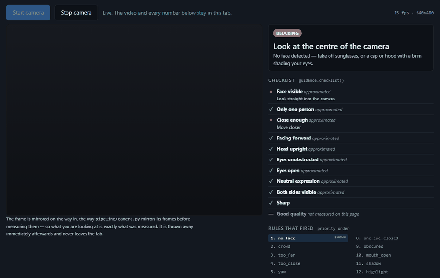

# Face Recognition Attendance System

[](https://github.com/luke-zhang-cs-py/Facial-Recognition-Software/actions/workflows/python-package.yml)
[](LICENSE)
[](https://www.python.org/)

A local attendance system: OpenCV reads the webcam, recognises enrolled faces,
and logs each one to SQLite. Everything stays on the machine — no cloud, no
face data leaving the room.

### ▶ [Point your own webcam at it →](https://luke-zhang-cs-py.github.io/Facial-Recognition-Software/camera/) · [or drive the same rules with sliders →](https://luke-zhang-cs-py.github.io/Facial-Recognition-Software/app/)



*Tracked live, judged live. The mesh and the measurements are MediaPipe's; the
instruction, the checklist and the priority chain are this project's
`pipeline/guidance.py` — fourteen rules in a fixed order, of which only the
first to fire is shown, so a person gets one thing to do instead of a list.
`tools/build_static.py` checks the published JavaScript against the Python and
refuses to publish if they disagree.*

> **The recording.** A still photograph was handed to the browser as if it were
> a camera, and the frame is painted over *after* the measurements are read —
> so the GIF carries the tracking and nobody's face. Open the page yourself and
> it is your own camera; no frame leaves the tab.

**Neither page recognises anyone.** Identification needs a 328 MB
`trainer.yml` and a camera the server owns; a tab gets detection, landmarks and
guidance. MediaPipe is not this project's detector either — the app uses YuNet
or Haar and OpenCV's 68-point LBF model — so the camera page labels every input
as the same measurement, an approximation, or not measured at all.

**[Read the full write-up →](https://luke-zhang-cs-py.github.io/Facial-Recognition-Software/)**
— the 97,698-face benchmark, where recognition stops working, and every bug
this has had. (Or open [`docs/index.html`](docs/index.html) locally.)

## Run it

```bash
pip install -r requirements.txt
python -m cli.fetch_models         # ~134 MB of pretrained weights, once
python app.py                      # http://127.0.0.1:5001
```

**It needs a real webcam**, opened by the *server* rather than the browser — so
it runs on the machine the camera is plugged into, which is why the demos above
cover only the parts that are pure arithmetic.

**Don't skip the middle line.** Attendance works without it, but the trait
readout, liveness, quality scoring and SFace identification degrade quietly,
which looks like the app being broken rather than incomplete. `GET /api/models`
reports which weights are missing.

Then register a person, capture ~30 samples, and the LBPH model retrains
itself; recognised faces get one `attendance` row per person per day. The CLI
does the same four steps — `cli.register_user`, `cli.attendance`,
`cli.view_report`. To try recognition without registering anyone,
`python -m cli.seed_demo --people 40 --samples 10` enrolls from LFW, and
`--remove` undoes it.

## Measured, not assumed

Benchmarked against all 97,698 images of FairFace. Full results in
**[BENCHMARK.md](BENCHMARK.md)**.

- **Detection is even** — 99.95%, widest race-group gap 0.08pp.
- **The quality gate used to be biased, and was fixed.** Absolute brightness
  and contrast thresholds encode skin tone, and flagged **38.8% of Black faces
  vs 18.5% of White faces** as "too dark". Gating now uses scale-free and
  learned signals only; disparity fell from 2.15× to 1.24×.
- **The right threshold depends on how many people are enrolled** — one swept
  over a few identities cannot see false matches. Measured over 4.77 billion
  impostor pairs: 0.425 at 10 people, 0.725 at 1,000, and **nothing sufficient
  past ~1,646**. That is the birthday problem, and it is why
  `analysis/calibration.py` takes a gallery size instead of returning a
  constant.
- **The gender estimator fails badly for Black women** (43.7%, worse than
  chance). Leave it off unless you have a reason not to.

**Effectiveness.** 40 enrolled, held-out LFW images: **92.9% correct**
(223/240), 6.7% rejected as unknown, **0.4% misidentified**, 100% impostor
rejection over 300 non-enrolled faces. The failure mode is the safe one.

**Operating range.** Detection holds at 100% throughout; recognition is what
degrades.

| Condition | Holds until | Breaks at |
|---|---|---|
| Distance (downscale) | 0.25× (83%) | 0.15× (23%) |
| Motion blur | 9 px (83%) | 13 px (47%) |
| Lighting (gamma 0.4–2.2) | **no measurable loss** | — |
| In-plane rotation | 15° (80%) | 30° (37%) |
| JPEG compression | q20 (83%) | q10 (77%) |

A tilted camera costs more than a dim room.

## Layout

```
app.py        the Flask entry point, and the only module left in the root
core/         paths, vision constants, the database, the model loaders
pipeline/     the capture path: camera, traits, landmarks, liveness,
              guidance, recognition, training
analysis/     enrollment quality, threshold sweeps, calibration, fairness
cli/          the command-line entry points
tools/        developer scripts, corpus benchmarks, the demo build
```

Thirty-one modules used to sit flat in the root, which said nothing about which
the recogniser needs and which is scripting. `tests/layout.py` writes the
grouping down once and the structural tests read it from there.

## Caveats that matter

- **Nothing gates on skin tone.** Exposure advice fires on clipped pixels, not
  average brightness — calling a face "too dark" for its complexion is the old
  quality gate's defect, more politely phrased. **Head coverings are not
  mentioned** either: the honest failure is "no face detected", not a guess at
  what somebody is wearing. Brims and dark lenses genuinely occlude, so those
  are named, and only when detection is actually failing.
- **Age** is a single figure with a ±6-year band, shown *with how often that
  band is right, which is ~40%*. That pairing is the point. MAE is 12.4 years
  over 10,946 FairFace faces.
- **Gender** guesses apparent presentation from pixels. It says nothing about
  anyone's identity, and it is materially less accurate for some groups.
- Both classifiers softmax over a fixed label set, so they return a confident
  label for *anything*, including a black frame; the live readout suppresses
  them when no face is detected.
- This measures **image and recogniser properties**. Inferring character or
  intent from face geometry is physiognomy: it does not work, and nothing here
  does it.
- **Privacy:** `dataset/` holds raw face images and `trainer.yml` a trained
  model. Treat both as sensitive biometric data — don't commit them, and delete
  a person's folder and retrain if they ask to be removed.

## Tests

```bash
pytest -q
```

382 tests, 81% of 2,315 statements, needing no webcam, no weights and no
corpus; the uncovered part is mostly the frame loop. Tests that need a real
face use a sample frame if one is present and **skip** rather than asserting
against a synthetic one, because a face a detector accepts cannot be faked
convincingly enough to be evidence.

## License

[MIT](LICENSE) — see [CONTRIBUTING.md](CONTRIBUTING.md) for setup and conventions.
